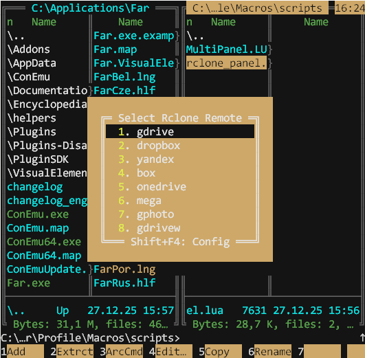

# Rclone Panel for Far Manager

Access your cloud storage (Google Drive, Dropbox, OneDrive, etc.) directly in Far Manager panels using rclone.

This project provides two versions of the script with different integration methods.

## Scripts Overview

### 1. `farclone-menu.lua` (Recommended)

This is the recommended script for most users. It provides a clean, manual way to access your rclone remotes without interfering with Far Manager's default behavior.

- **Triggers:**
    - Via the **Plugins Menu** (`F11` -> "Rclone Remotes").
    - Via the command line prefix `farclone:`.
- **Pros:** Does not change panel focus unexpectedly. Can be assigned to any hotkey by the user via standard Far macros (e.g., in the F2 User Menu, create a command `farclone:`).

### 2. `farclone-disk.lua`

This is the original version of the script that integrates directly into the Disks menu (`Alt+F1`/`Alt+F2`).

- **Triggers:**
    - Via the **Disks Menu** ("Rclone Remotes" entry).
- **Pros:** Quick access directly from the Disks menu.
- **Cons:** **Has a significant side-effect.** To show the Disks menu on the correct panel, it has to programmatically switch the active panel first. This breaks the standard Far workflow for changing the directory of an *inactive* panel. Use this only if you understand and accept this behavior.

## Features

- Quick access to rclone remotes.
- Hotkeys 1-9, 0, A-Z for fast remote selection.
- Automatic SFTP server management on a local port.
- Ability to invoke `rclone config` editor (`Shift+F4` from the menu).
- Manual server control (stop with `F8` from the menu).
- Auto-timeout after a configurable period of inactivity.
- Visual indication of the running server in the menu.

## Requirements

- [Far Manager 3.x](https://www.farmanager.com/)
- [NetBox plugin](https://github.com/michaellukashov/Far-NetBox) (usually included with Far).
- [Rclone](https://rclone.org/downloads/)

## Installation

1. Install rclone and configure your remotes (`rclone config`).

2. Choose **one** of the scripts and copy it to your Far Manager macros directory. The directory is usually located at:
   ```
   %FARPROFILE%\Macros\scripts\
   ```
   - **Recommended:** Copy `farclone-menu.lua`.
   - **Alternative:** Copy `farclone-disk.lua`.

3. Restart Far Manager or reload macros by typing `macro:load` in the command line.

4. (Optional) Edit the script configuration (e.g., path to rclone) at the top of the `.lua` file you chose.

## Configuration

Edit the variables at the top of the `.lua` file you are using (`farclone-menu.lua` or `farclone-disk.lua`):

```lua
-- Configuration (use \\ for paths in Windows)
local RclonePath = "C:\\path\\to\\rclone\\rclone.exe"
local ConfigPath = ""  -- e.g., "C:\\Users\\You\\AppData\\Roaming\\rclone\\rclone.conf"
local Timeout = 10     -- Server timeout in minutes
-- ...and other server settings.
```

## How It Works

When you select a remote from the menu:

1. The script starts an `rclone serve sftp` server on localhost for the chosen remote.
2. The NetBox plugin is then used to connect to this local SFTP server (`sftp://remotename@127.0.0.1`).
3. The server automatically stops after an idle timeout, when you exit Far, or when you manually stop it.

## Troubleshooting

### "No remotes found" error

Run `rclone config` and create at least one remote. Verify with `rclone listremotes`.

### "Ports in use" error

Another application is using the script's configured ports. Either:
- Close the conflicting application.
- Change `ServPort` and `RCPort` in the script's configuration section.

### Rclone config window requires manual close

After exiting rclone config with 'q', the console window should close automatically. If it doesn't, press Enter or close it manually.

## Screenshots



## License

MIT

## Author

Developed with AI assistance.

## Contributing

Contributions are welcome! Please feel free to submit issues and pull requests.

## Links

- [Rclone Documentation](https://rclone.org/docs/)
- [Far Manager](https://www.farmanager.com/)
- [NetBox Plugin](https://github.com/michaellukashov/Far-NetBox)
